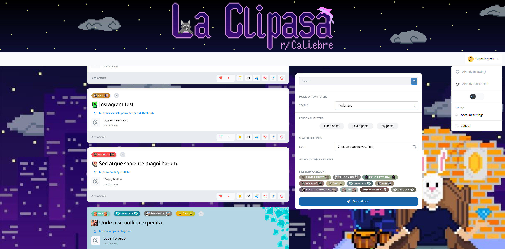

# La Clipasa

*Work in progress*

Migration of the weekly meme subreddit Twitch stream of https://www.reddit.com/r/Caliebre/
using:
- Vercel edge functions
- Mantine UI SPA with Vite
- Supabase + Prisma data proxy
- Twitch authentication

Check out the progress over at: https://laclipasa.vercel.app

## Alternative deployments

- fly.io
- GCP micro instance
- https://workers.cloudflare.com/ with honojs

## TODO

- i18n

- Audio normalizer with `DynamicsCompressorNode` API. Should find a way to apply
  to any source that is being played:
    - see
      https://stackoverflow.com/questions/52168962/adjusting-the-volume-of-music-ingame

- Discord as a CDN

- [prisma data proxy cannot be used in local development
  ](https://github.com/prisma/prisma/issues/14398).
Checkout [supabase js client for
edge](https://github.com/supabase/supabase/discussions/6321)
- Checkout raw SQL with Postgres alternatives for the edge. Prisma proving to be quite a
  let-down.

